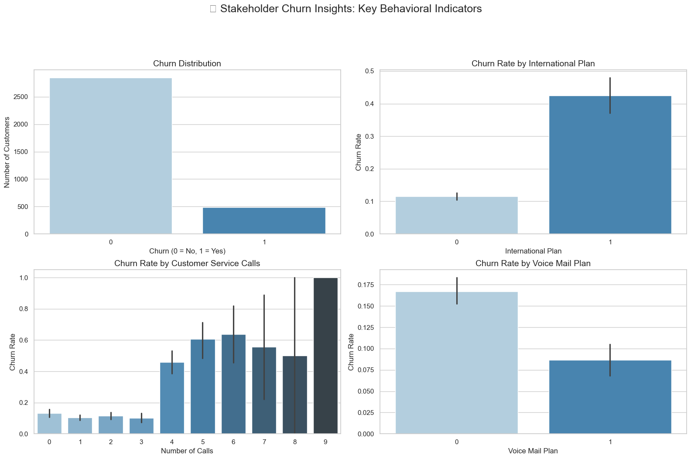
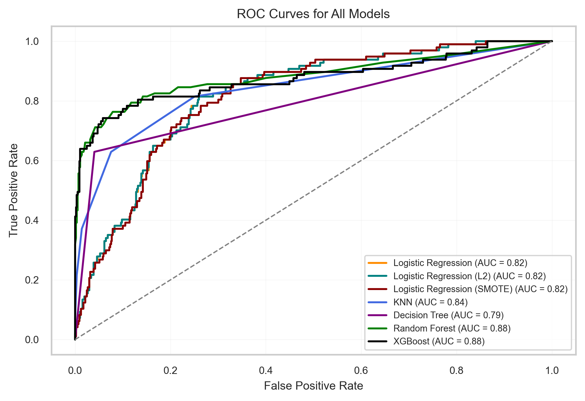
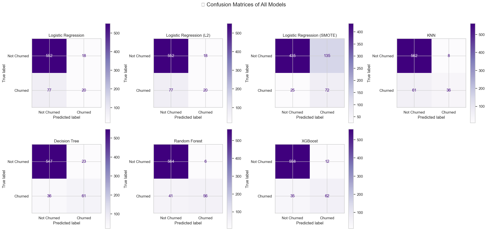
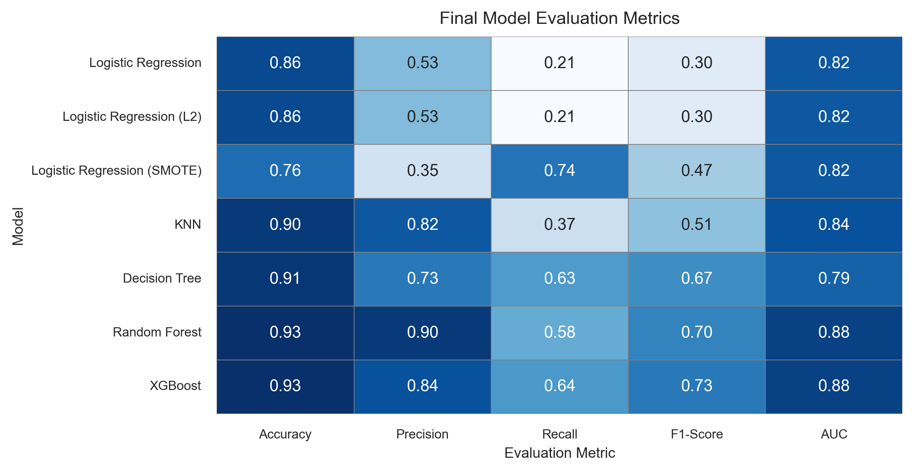

# Customer Churn Prediction: Data-Driven Insights for Proactive Retention


### Author : Rachel Odhiambo

## Introduction

In today's competitive business landscape, customer retention is paramount for sustainable growth and success. Our challenge is to develop a predictive model that can identify customers who are at risk of churning – discontinuing their use of our service.

Customer churn can lead to a significant loss of revenue and a decline in market share. By leveraging machine learning techniques, we aim to build a model that can accurately predict whether a customer is likely to churn based on their historical usage behavior, demographic information, and subscription details.

This predictive model will allow us to proactively target high-risk customers with personalized retention strategies, ultimately helping us enhance customer satisfaction, reduce churn rates, and optimize our business strategies.

The goal is to create an effective solution that contributes to the long-term success of our company by fostering customer loyalty and engagement.


## Project Overview

This project leverages machine learning to predict customer churn using the **SyriaTel Telecom** dataset. It includes thorough data exploration, model experimentation, and final recommendations to help stakeholders reduce churn and improve retention.


## Business Understanding

### Real-World Applications of Customer Churn Prediction

**Telecommunications**  
Just like SyriaTel, companies such as Safaricom, Airtel, and Telkom Kenya can use churn models to identify at-risk customers and implement targeted retention strategies (e.g., discounts, loyalty rewards).

**Banking & Fintech**  
Apps like M-Pesa, KCB App, and Tala can use churn prediction to keep users active by offering incentives before they switch to competitors.

**Subscription Services**  
Netflix and Spotify use similar models to understand when users are likely to cancel subscriptions, then act proactively by sending personalized content or offers.

**E-commerce & Retail**  
Jumia and Amazon can apply churn models to predict when frequent customers are about to leave and respond with promo codes, personalized suggestions, or improved user experience.

**Ride-Hailing**  
Companies like Bolt and Uber can track user inactivity and re-engage riders or drivers through churn prediction strategies and retention campaigns.


## Stakeholders and Business Value

This project provides valuable insights that can directly support strategic decisions across departments:

**Customer Service Team**  
Can proactively reach out to customers flagged as high churn risk and provide personalized support or solutions to improve satisfaction.

**Marketing Department**  
Uses churn predictions to design focused, cost-effective campaigns targeting users most likely to leave, increasing retention while reducing marketing spend.

**Product Managers**  
Gain insight into which features, services, or user experiences are linked to churn, helping them prioritize improvements that matter most.

**Sales Executives**  
Can leverage churn risk scores to target users for upselling, renewal offers, or loyalty programs that keep them engaged.

**Senior Management**  
Benefits from data-driven insights that support long-term strategic decisions aimed at improving customer lifetime value and reducing customer acquisition costs.

**Data Science Team**  
Demonstrates the real business value of predictive modeling and machine learning by tackling a problem that has clear financial and operational impact.


## Project Goals

The primary goal of this project is to build a predictive machine learning model that can accurately identify customers who are likely to churn (i.e., stop using the service). By analyzing customer behavior and attributes, the project aims to:

- Understand the key factors contributing to customer churn  
- Predict churn early enough for the company to take proactive measures  
- Provide actionable insights that help improve customer retention strategies  
- Support data-driven decision-making across business units like marketing, customer service, and management  

Ultimately, this project helps reduce customer loss, improve customer satisfaction, and increase the company’s revenue and profitability.


### Key Business Questions

This project is designed to answer the following critical business questions:

1. Which customers are most likely to churn?  
2. What are the most important factors influencing customer churn?  
3. Can we segment customers based on churn risk for better targeting?  
4. How well can machine learning models predict churn based on available data?  
5. How can we use these predictions to design effective retention strategies?  
6. Which departments can benefit the most from this information, and how?


## About the Data
T## 1. About the Data

This project uses the **SyriaTel Customer Churn dataset**, which simulates real-world telecom customer behavior to predict churn.

###  Dataset Summary

1. **Source**: [Kaggle – Churn in Telecoms Dataset]
2. **Records**: 3,333 customers  
3. **Target Variable**: `Churn` – Indicates whether a customer left (`Yes`) or stayed (`No`)  
4. **Features**: Customer demographics, account details (e.g., total minutes, charges, customer service calls), and services subscribed.

### Preprocessing Steps

1. Handled outliers and dropped columns with high cardinality 
2. Converted categorical variables using one-hot encoding  
3. Scaled numerical features using `StandardScaler`  
4. Applied SMOTE to balance the classes (`Churn`: Yes vs No)

### Limitations

1. **Class Imbalance** – Majority of customers did not churn  
2. **No Time-Series Data** – Limits behavioral trend analysis  
3. **Synthetic Dataset** – Based on simulated data


##  Tools Used

This project was completed using the following tools and technologies:

1. **Python** – Main programming language for data analysis and modeling  
2. **Pandas** – For data loading, exploration, and manipulation  
3. **NumPy** – For numerical operations and array handling  
4. **Matplotlib** and **Seaborn** – For data visualization and exploratory analysis  
5. **Scikit-learn** – For machine learning models, preprocessing, and evaluation metrics  
6. **XGBoost** – For gradient boosting and high-performance classification  
7. **SMOTE** (from `imblearn`) – For handling class imbalance  
8. **Jupyter Notebook** – For interactive development and documentation  
9. **Git** & **GitHub** – For version control and project collaboration

## Analysis Approach

The project followed a structured data science process:

1. **Problem Definition** – Defined the goal of predicting customer churn to reduce revenue loss.
2. **Exploratory Data Analysis (EDA)** – Explored churn patterns based on service usage, call behavior, and subscription plans.
3. **Data Preprocessing** – Handled missing values, encoded categorical data, scaled features, and applied SMOTE for class balance.
4. **Feature Analysis** – Focused on churn by customer service calls, voicemail plan, international plan, number of calls, and state.
5. **Modeling** – Trained multiple classification models including Logistic Regression, Decision Tree, Random Forest, and XGBoost.
6. **Evaluation** – Assessed model performance using accuracy, precision, recall, F1-score, and ROC-AUC.
7. **Insights & Recommendations** – Interpreted results to suggest targeted retention strategies.


## Insights & Visual Analysis

To better understand the drivers of churn, several key factors were analyzed. The findings were visualized to reveal patterns and behaviors linked to higher churn rates.

### Key Churn Insights:

- **Customer Service Calls**: Higher churn observed among customers who contacted customer service frequently.
- **Voice Mail Plan**: Customers without a voicemail plan showed slightly higher churn tendencies.
- **Total Calls vs. Churn**: Explored how overall call volume relates to churn rate.
- **International Plan**: Customers with international plans were significantly more likely to churn.
- **Geographical Churn Patterns**: Churn rates were also analyzed across different U.S. states to uncover location-based trends.

### Visual Summary




## Expected Deliverables

1. **Cleaned Dataset** – Preprocessed and ready for modeling.  
2. **EDA Visuals** – Key churn insights and visualizations.  
3. **ML Models** – Multiple trained models for churn prediction.  
4. **Model Evaluation** – Performance metrics and comparison.  
5. **Churn Insights Chart** – Summary visual of churn patterns.  
6. **Recommendations** – Actionable insights to reduce churn.  
7. **Jupyter Notebook** – Full project workflow and documentation.  
8. **Presentation Slides** – Summary for stakeholders.  
9. **GitHub Repo** – All project files, organized and shareable.


## Visualizations

## Key Visualizations

1. **Churn Insights Chart**  
   Combines multiple churn factors into one view, showing relationships between churn and:
   - Customer service calls  
   - International plan  
   - Voicemail plan  
   - Total number of calls  

2. **Churn by State**  
   Visualizes churn distribution across U.S. states to identify geographic patterns.


##  Models Used and Evaluation Strategies

To predict customer churn, several supervised classification models were trained and evaluated.

### Models Trained

1. **Logistic Regression** – Used as a baseline model for performance comparison.  
2. **Logistic Regression (L2 Regularization)** – Added regularization to reduce overfitting.  
3. **Logistic Regression with SMOTE** – Addressed class imbalance using oversampling.  
4. **K-Nearest Neighbors (KNN)** – Captured nonlinear relationships based on feature similarity.  
5. **Decision Tree** – Simple and interpretable tree-based model.  
6. **Random Forest** – Ensemble of decision trees for improved performance and robustness.  
7. **XGBoost** – Advanced gradient boosting technique; best performer in our experiments.

### 6.Evaluation Strategy

We evaluated model performance using the following metrics:

- **Accuracy** – Overall correctness of predictions.  
- **Precision** – How many predicted churns were correct.  
- **Recall** – How many actual churns were detected.  
- **F1-Score** – Balance between precision and recall.  
- **ROC-AUC Score** – How well the model separates churn vs. non-churn.

Due to class imbalance, **recall** and **ROC-AUC** were prioritized over accuracy.

---

### 🔍 Visual Comparison of Models

#### 📉 ROC Curves
Shows model performance in distinguishing churn vs. non-churn.



#### 📊 Confusion Matrices
Illustrates prediction breakdown: TP, FP, TN, FN for each model.



#### 📋 Metric Comparison Summary
Side-by-side comparison of all model evaluation metrics.




Conclusion & Key Takeaways

This project successfully built and evaluated multiple machine learning models to predict customer churn, with **XGBoost emerging as the top performer** due to its strong balance of precision, recall, and scalability.

### Key Takeaways

- **XGBoost** is the recommended model for deployment due to its ability to accurately identify churners with minimal false positives.
- **Recall vs. Precision trade-offs** are critical: models like SMOTE-boosted Logistic Regression are better for catching all churners, while models like KNN minimize false alarms.
- **Random Forest** and **Decision Tree** offer solid performance with better interpretability but are slightly outperformed by XGBoost in this context.
- **Business integration is key**: the model should be tied to CRM systems and dashboards for real-time churn monitoring and decision-making.
- **Ongoing monitoring and retraining** are essential to maintain accuracy as customer behavior evolves.

> By leveraging advanced ML techniques and focusing on actionable metrics, this project offers a **data-driven, scalable solution** to reduce churn and improve customer retention strategies.


## Repository Structure

This project is structured for clarity, reproducibility, and smooth collaboration. Below is a breakdown of all files and directories:

Customer_Churn_Prediction/
├── churn_prediction_notebook.ipynb     
├── Output/ # Folder for saved plots and evaluation visuals
│ ├── churn_analysis_hd.png 
│ ├── churn_insights.png
│ ├── confusion_matrices.png
│ ├── roc_curves_compact.png # 
│ └── model_evaluation_compact.png 
├──  README.md 
├──   requirements.txt # List of Python libraries used in the project
├─gitgignore
├──gitattributes
├──presentation.pdf


## How to Run

## 🚀 How to Run This Project

Follow the steps below to reproduce the results and explore the project:

### 1. Clone the Repository

```bash
git clone https://github.com/your-username/customer_churn_prediction.git
cd customer_churn_prediction


## Questions?
Feel free to reach out or submit issues in this repo!